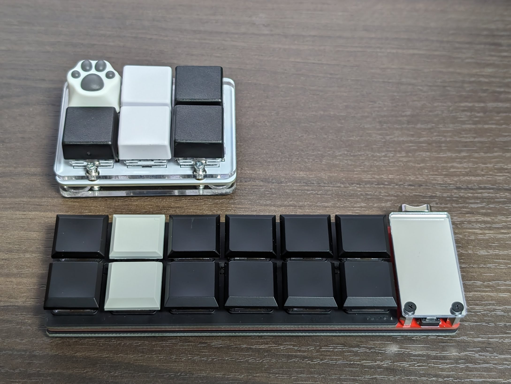

初稿: 2023-12-16
小松弘幸 ([@komatsuh:twitter](https://twitter.com/komatsuh),
[@komatsuh:bsky](https://bsky.app/profile/komatsuh.bsky.social))

グループで自作キーボードを作りに行きました。とてもよい体験でしたので文章にまとめます。

## はじめに

会社のみんなでなにかを一緒にしようとなりました。
遊園地や映画館に行ったり食事をすることが定番なのですが、今回はキーボードを作ることになりました。
ソフトウェアエンジニアのグループでしたので、キーボードは日常的に扱っていますし、
制作を通じてキーボードのハードウェア的な仕組みへの理解が深められそうなのもよい点です。

実際に理解が深まりましたし、やってみないと気付けないことをいろいろ発見できたこともよかったです。

## 遊舎工房

秋葉原は末広町の「遊舎工房」という自作キーボードの専門店にみんなで出かけました。
お店でキーボードの制作キットなどの材料を選んで、その場で組み立てようという計画です。
遊舎工房には工作室があり必要な道具と作業場所を借りられますので、まったくの初心者でも大丈夫でした。

https://shop.yushakobo.jp/

工作室は事前に予約することで日程によっては貸し切りにもできます。
工作室の定員に近い10人での活動でしたので、貸し切りをお願いできる日に合わせて日程を組みました。
貸し切りできる時間と、お店の開業時間がずれていることもありますので、事前に確認しておくとよいでしょう。

https://shop.yushakobo.jp/products/workshop_rental_service

## 当日の流れ

1. はんだ付け講習会
2. キーボードキットの選定・購入
3. キーボードの組み立て

## はんだ付け講習会

はんだ付けの初心者が大半でしたので、希望者は練習キットを購入して、はんだ付けの基礎からはじめました。
制作するキーボードによっては、はんだ付けをまったく必要としない場合もありますが、はんだ付けの体験自体も楽しいものでした。
はんだ付けの練習キットはそのままマクロパッドとして動作するキーボードのキットにもなっています。

https://akiba-pc.watch.impress.co.jp/docs/news/news/1546983.html
https://twitter.com/yushakobo_shop/status/1722887340987985947

## キーボードキットの選定・購入

店舗の方で、制作したいキーボードキットを選びます。
キーの数、はんだ付けの有無、予算などから好みのものを決めていきます。
押し心地を決めるキースイッチや、手触りや外見を決めるキーキャップを選ぶだけでもしばらく楽しく悩めます。
質問や相談には店員の方々が詳しく丁寧に教えてくださいました。

自分では hifumi と Dozen0 を選びました。

https://shop.yushakobo.jp/products/a0900kj-00-1
https://shop.yushakobo.jp/products/dozen0

## キーボードの組み立て

もくもくとはんだ付けをする人、同じキーボードキットを購入して相談しながら組み立てる人、
雑談をいれながらわいわい作業をする人、それぞれのやり方で楽しみながら作れます。
作業はキットごとのビルドガイドや作成動画にしたがって進めていきます。

https://github.com/yynmt/Dozen0/blob/master/docs/buildguide_jp.md

工数が少ないキーボードを選んで早めにできてしまった人は、おかわりの2台目を作ったり、設定を自分好みに変更したりしていました。
自分は最初に制作した6キーのマクロパッドに3時間、おかわりの12キーのマクロパッドは1時間で完成しました。
個人差はありそうですが、未経験でも制作時間が5時間あればフルキーボードを完成させられるのではと思います。

*最初のマクロパッドが組み終わって、おかわりを組みはじめたところ*

## 用意しておくとよさそうなもの

なくても大丈夫なのですが、用意しておくとより便利だったものです。

* キーボード設定用 PC
    * 工作室の PC を借りることもできます
* マイクロ USB ケーブル
    * 自作キーボードではマイクロ USB ケーブルが使われることがおおいので、自分のデバイスとをつなぐためのケーブルです
* 作業用眼鏡や拡大鏡
    * 細かい部品を見るのに便利です

基本的な工具類はすべて借りられました。追加料金はありません。

## グループ活動としての自作キーボード

交流を深める活動としての自作キーボード会は、料理教室や写生大会に近いものかなと感じました。
それぞれが別々のことをしているけれど、いつでもゆるいつながりと話題の共有はされている感じの交流です。
作ったキーボードを業務や日常で便利に活用できるようになるのもうれしい点です。
後日グループのみんながどのように使っているかの話をするのも楽しいです。

*できあがったマクロパッド*

## さいごに

グループでの交流、電子工作への入門、仕事道具の改善などがまとめて得られるとてもよい体験でした。
工作室や店舗のスタッフの方々には丁寧かつフレンドリーに対応していただけました。

グループ活動をなにか検討しているのでしたら、自作キーボードをみんなで作るのはおすすめです。
